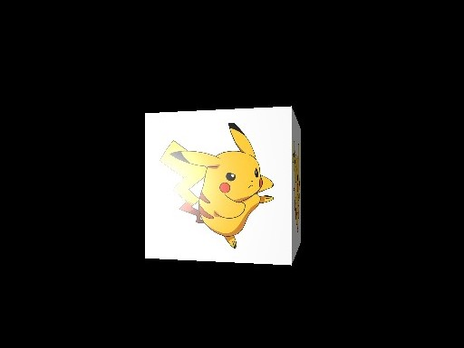

# Rasterizer

<p align="center">
  
</p>

## Features

* Reads geometry from ``.obj`` files. 
* Supports Diffuse textures.
* Implements phong shading.
* Z-Buffering
* Backface culling
* Custom Resolutions

### Usage

```c++
std::vector<std::unique_ptr<LightSource>> lights;  // vector to hold light sources
lights.push_back(std::make_unique<PointLight>(glm::vec3{-5, 0, 0}));  // create a light
lights.push_back(std::make_unique<AmbientLight>());

std::vector<Triangle> cube_geometry;  // vector to hold mesh tris

if (!utility::ReadFile(cube_geometry, "resources/obj/cube.obj", "resources/materials/pikachu_tx.bmp")) {
    return -1;
}  // read ready geometry from file

Mesh cube{ 
    cube_geometry,
    {0, 0, 6},
    {1, 1, 1},
    {0, 0, 0}
};  // create mesh

Renderer<sRGB, SD> renderer;  // create renderer
renderer.AddMesh(cube);  // add mesh


renderer.SetCamera({0, 0, 0}, {0, 0, 1}, {0, 1, 0});  // set camera
renderer.SetVerticalFOV(36.0f);  // set fov
renderer.SetLights(lights);  // set lights

renderer.Run();  // run main loop
```